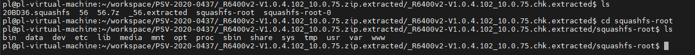
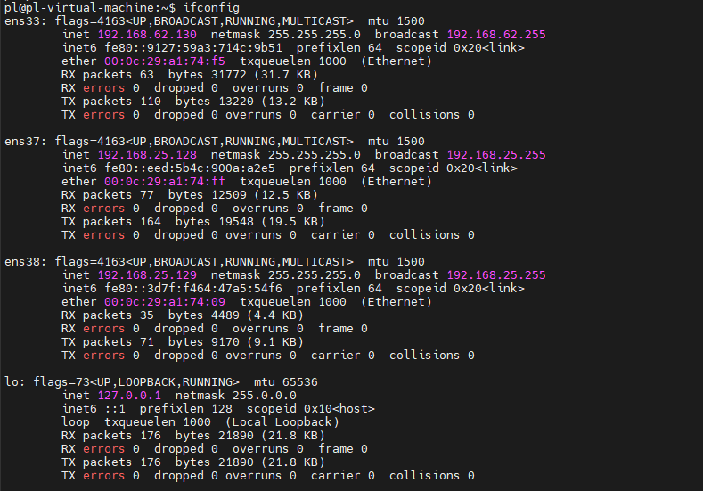
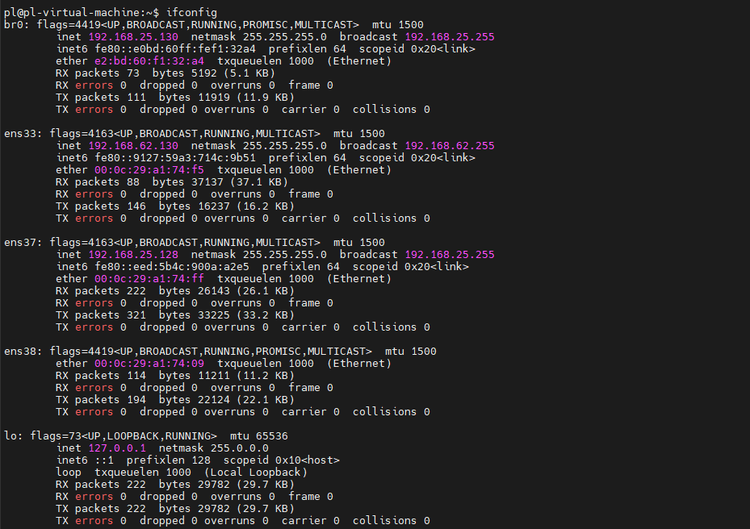
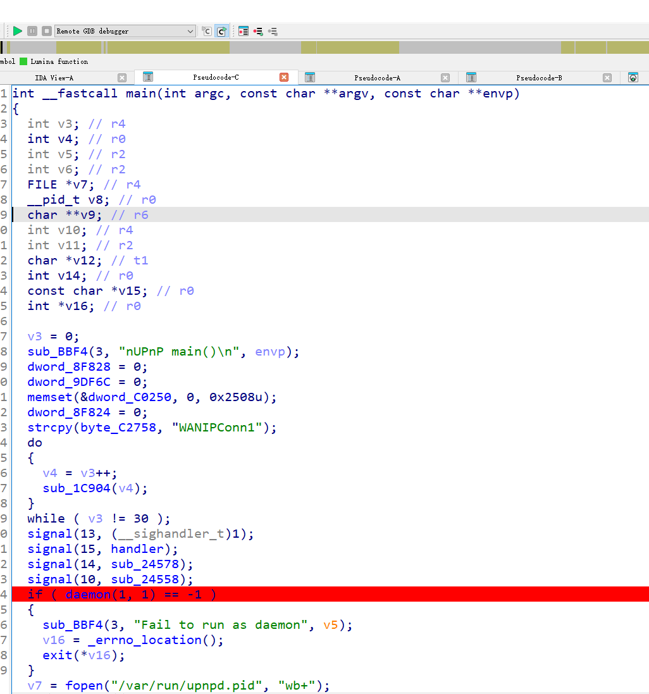
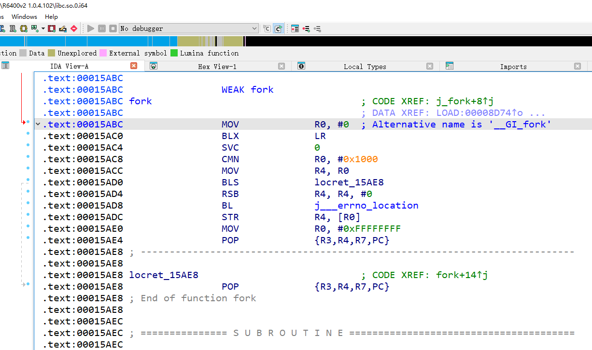
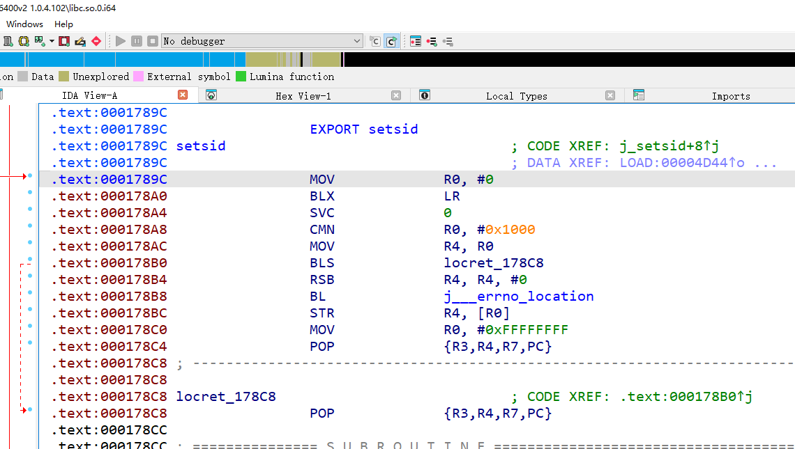
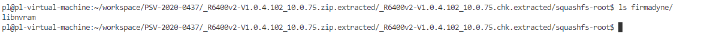
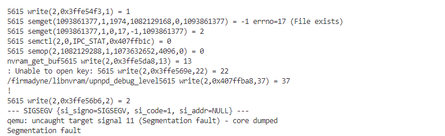
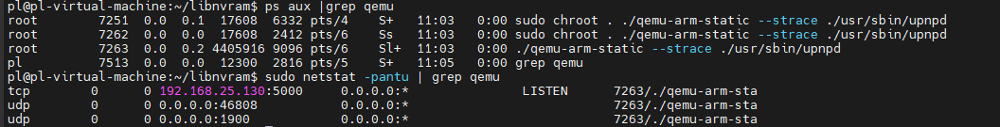

# Netgear R6400v2 1.0.4.102 upnp 服务仿真

[R6400v2-V1.0.4.102_10.0.75.zip](https://www.downloads.netgear.com/files/GDC/R6400v2/R6400v2-V1.0.4.102_10.0.75.zip)

## 固件解压

通过 binwalk 解压固件

```bash
binwalk -Me R6400v2-V1.0.4.102_10.0.75.zip
```



## Qemu 网络配置

查看当前虚拟机网卡配置



设置 br0 桥接网卡

```bash
sudo ifconfig ens38 down    
sudo brctl addbr br0
sudo brctl addif br0 ens38   
sudo brctl stp br0 off                  
sudo ifconfig br0 0.0.0.0 promisc up     
sudo ifconfig ens38 0.0.0.0 promisc up    
sudo dhclient br0                    
sudo brctl show br0                     
brctl showstp br0                   
```



创建 tap 接口

```bash
sudo tunctl -t tap0 -u root              
sudo brctl addif br0 tap0               
sudo ifconfig tap0 0.0.0.0 promisc up    
sudo brctl showstp br0                  
```

## 固件仿真

目标程序为 upnp，确定指令架构如下：

```bash
# 查找 upnpd 程序路径
$ find . -name upnp*
./usr/sbin/upnpd
./www/upnp.ico
# 查看 upnpd 文件架构
$ file ./usr/sbin/upnpd
./usr/sbin/upnpd: ELF 32-bit LSB executable, ARM, EABI5 version 1 (SYSV), dynamically linked, interpreter /lib/ld-uClibc.so.0, stripped
```

确定架构为 32bit arm 小端序，使用 qemu-arm-static 运行 upnpd 程序

```bash
$ sudo chroot ./ ./qemu-arm-static --strace ./usr/sbin/upnpd
```
<details>
<summary>点击查看输出</summary>
<pre><code class="language-bash">
15107 mmap2(NULL,4096,PROT_READ|PROT_WRITE,MAP_PRIVATE|MAP_ANONYMOUS|MAP_UNINITIALIZED,-1,0) = 0x3fff0000
15107 open("/lib/libnvram.so",O_RDONLY) = -1 errno=2 (No such file or directory)
15107 open("/lib/libnvram.so",O_RDONLY) = -1 errno=2 (No such file or directory)
15107 open("/usr/lib/libnvram.so",O_RDONLY) = 3
15107 fstat(3,0x40800048) = 0
15107 mmap2(NULL,4096,PROT_READ|PROT_WRITE,MAP_PRIVATE|MAP_ANONYMOUS|MAP_UNINITIALIZED,-1,0) = 0x3ffef000
15107 read(3,0x3ffef000,4096) = 4096
15107 mmap2(NULL,147456,PROT_NONE,MAP_PRIVATE|MAP_ANONYMOUS,-1,0) = 0x3ffcb000
15107 mmap2(0x3ffcb000,51824,PROT_EXEC|PROT_READ,MAP_PRIVATE|MAP_FIXED,3,0) = 0x3ffcb000
15107 mmap2(0x3ffe0000,18540,PROT_READ|PROT_WRITE,MAP_PRIVATE|MAP_FIXED,3,0xd) = 0x3ffe0000
15107 mmap2(0x3ffe5000,39028,PROT_READ|PROT_WRITE,MAP_PRIVATE|MAP_ANONYMOUS|MAP_FIXED,-1,0) = 0x3ffe5000
15107 close(3) = 0
15107 munmap(0x3ffef000,4096) = 0
15107 open("/lib/libacos_shared.so",O_RDONLY) = -1 errno=2 (No such file or directory)
15107 open("/lib/libacos_shared.so",O_RDONLY) = -1 errno=2 (No such file or directory)
15107 open("/usr/lib/libacos_shared.so",O_RDONLY) = 3
15107 fstat(3,0x40800038) = 0
15107 mmap2(NULL,4096,PROT_READ|PROT_WRITE,MAP_PRIVATE|MAP_ANONYMOUS|MAP_UNINITIALIZED,-1,0) = 0x3ffca000
15107 read(3,0x3ffca000,4096) = 4096
15107 mmap2(NULL,344064,PROT_NONE,MAP_PRIVATE|MAP_ANONYMOUS,-1,0) = 0x3ff76000
15107 mmap2(0x3ff76000,245768,PROT_EXEC|PROT_READ,MAP_PRIVATE|MAP_FIXED,3,0) = 0x3ff76000
15107 mmap2(0x3ffba000,9848,PROT_READ|PROT_WRITE,MAP_PRIVATE|MAP_FIXED,3,0x3c) = 0x3ffba000
15107 mmap2(0x3ffbd000,52764,PROT_READ|PROT_WRITE,MAP_PRIVATE|MAP_ANONYMOUS|MAP_FIXED,-1,0) = 0x3ffbd000
15107 close(3) = 0
15107 munmap(0x3ffca000,4096) = 0
15107 open("/lib/libnat.so",O_RDONLY) = -1 errno=2 (No such file or directory)
15107 open("/lib/libnat.so",O_RDONLY) = -1 errno=2 (No such file or directory)
15107 open("/usr/lib/libnat.so",O_RDONLY) = 3
15107 fstat(3,0x40800028) = 0
15107 mmap2(NULL,4096,PROT_READ|PROT_WRITE,MAP_PRIVATE|MAP_ANONYMOUS|MAP_UNINITIALIZED,-1,0) = 0x3ff75000
15107 read(3,0x3ff75000,4096) = 4096
15107 mmap2(NULL,69632,PROT_NONE,MAP_PRIVATE|MAP_ANONYMOUS,-1,0) = 0x3ff64000
15107 mmap2(0x3ff64000,65488,PROT_EXEC|PROT_READ,MAP_PRIVATE|MAP_FIXED,3,0) = 0x3ff64000
15107 mmap2(0x3ff74000,836,PROT_READ|PROT_WRITE,MAP_PRIVATE|MAP_FIXED,3,0x10) = 0x3ff74000
15107 close(3) = 0
15107 munmap(0x3ff75000,4096) = 0
15107 open("/lib/libcrypt.so.0",O_RDONLY) = 3
15107 fstat(3,0x40800030) = 0
15107 mmap2(NULL,4096,PROT_READ|PROT_WRITE,MAP_PRIVATE|MAP_ANONYMOUS|MAP_UNINITIALIZED,-1,0) = 0x3ff63000
15107 read(3,0x3ff63000,4096) = 4096
15107 mmap2(NULL,118784,PROT_NONE,MAP_PRIVATE|MAP_ANONYMOUS,-1,0) = 0x3ff46000
15107 mmap2(0x3ff46000,8948,PROT_EXEC|PROT_READ,MAP_PRIVATE|MAP_FIXED,3,0) = 0x3ff46000
15107 mmap2(0x3ff50000,4096,PROT_READ|PROT_WRITE,MAP_PRIVATE|MAP_FIXED,3,0x2) = 0x3ff50000
15107 mmap2(0x3ff51000,70248,PROT_READ|PROT_WRITE,MAP_PRIVATE|MAP_ANONYMOUS|MAP_FIXED,-1,0) = 0x3ff51000
15107 close(3) = 0
15107 munmap(0x3ff63000,4096) = 0
15107 open("/lib/libcrypto.so.1.0.0",O_RDONLY) = 3
15107 fstat(3,0x40800020) = 0
15107 mmap2(NULL,4096,PROT_READ|PROT_WRITE,MAP_PRIVATE|MAP_ANONYMOUS|MAP_UNINITIALIZED,-1,0) = 0x3ff45000
15107 read(3,0x3ff45000,4096) = 4096
15107 mmap2(NULL,1576960,PROT_NONE,MAP_PRIVATE|MAP_ANONYMOUS,-1,0) = 0x3fdc4000
15107 mmap2(0x3fdc4000,1453048,PROT_EXEC|PROT_READ,MAP_PRIVATE|MAP_FIXED,3,0) = 0x3fdc4000
15107 mmap2(0x3ff2e000,84440,PROT_READ|PROT_WRITE,MAP_PRIVATE|MAP_FIXED,3,0x162) = 0x3ff2e000
15107 mmap2(0x3ff43000,7180,PROT_READ|PROT_WRITE,MAP_PRIVATE|MAP_ANONYMOUS|MAP_FIXED,-1,0) = 0x3ff43000
15107 close(3) = 0
15107 munmap(0x3ff45000,4096) = 0
15107 open("/lib/libgcc_s.so.1",O_RDONLY) = 3
15107 fstat(3,0x40800010) = 0
15107 mmap2(NULL,4096,PROT_READ|PROT_WRITE,MAP_PRIVATE|MAP_ANONYMOUS|MAP_UNINITIALIZED,-1,0) = 0x3fdc3000
15107 read(3,0x3fdc3000,4096) = 4096
15107 mmap2(NULL,73728,PROT_NONE,MAP_PRIVATE|MAP_ANONYMOUS,-1,0) = 0x3fdb1000
15107 mmap2(0x3fdb1000,39128,PROT_EXEC|PROT_READ,MAP_PRIVATE|MAP_FIXED,3,0) = 0x3fdb1000
15107 mmap2(0x3fdc2000,2800,PROT_READ|PROT_WRITE,MAP_PRIVATE|MAP_FIXED,3,0x9) = 0x3fdc2000
15107 close(3) = 0
15107 munmap(0x3fdc3000,4096) = 0
15107 open("/lib/libm.so.0",O_RDONLY) = 3
15107 fstat(3,0x40800000) = 0
15107 mmap2(NULL,4096,PROT_READ|PROT_WRITE,MAP_PRIVATE|MAP_ANONYMOUS|MAP_UNINITIALIZED,-1,0) = 0x3fdb0000
15107 read(3,0x3fdb0000,4096) = 4096
15107 mmap2(NULL,102400,PROT_NONE,MAP_PRIVATE|MAP_ANONYMOUS,-1,0) = 0x3fd97000
15107 mmap2(0x3fd97000,61388,PROT_EXEC|PROT_READ,MAP_PRIVATE|MAP_FIXED,3,0) = 0x3fd97000
15107 mmap2(0x3fdae000,4100,PROT_READ|PROT_WRITE,MAP_PRIVATE|MAP_FIXED,3,0xf) = 0x3fdae000
15107 close(3) = 0
15107 munmap(0x3fdb0000,4096) = 0
15107 open("/lib/libbdbroker.so",O_RDONLY) = 3
15107 fstat(3,0x407ffff0) = 0
15107 mmap2(NULL,4096,PROT_READ|PROT_WRITE,MAP_PRIVATE|MAP_ANONYMOUS|MAP_UNINITIALIZED,-1,0) = 0x3fd96000
15107 read(3,0x3fd96000,4096) = 4096
15107 mmap2(NULL,98304,PROT_NONE,MAP_PRIVATE|MAP_ANONYMOUS,-1,0) = 0x3fd7e000
15107 mmap2(0x3fd7e000,58488,PROT_EXEC|PROT_READ,MAP_PRIVATE|MAP_FIXED,3,0) = 0x3fd7e000
15107 mmap2(0x3fd94000,1724,PROT_READ|PROT_WRITE,MAP_PRIVATE|MAP_FIXED,3,0xe) = 0x3fd94000
15107 mmap2(0x3fd95000,3324,PROT_READ|PROT_WRITE,MAP_PRIVATE|MAP_ANONYMOUS|MAP_FIXED,-1,0) = 0x3fd95000
15107 close(3) = 0
15107 munmap(0x3fd96000,4096) = 0
15107 open("/lib/libpthread.so.0",O_RDONLY) = 3
15107 fstat(3,0x407fffe0) = 0
15107 mmap2(NULL,4096,PROT_READ|PROT_WRITE,MAP_PRIVATE|MAP_ANONYMOUS|MAP_UNINITIALIZED,-1,0) = 0x3fd7d000
15107 read(3,0x3fd7d000,4096) = 4096
15107 mmap2(NULL,106496,PROT_NONE,MAP_PRIVATE|MAP_ANONYMOUS,-1,0) = 0x3fd63000
15107 mmap2(0x3fd63000,42340,PROT_EXEC|PROT_READ,MAP_PRIVATE|MAP_FIXED,3,0) = 0x3fd63000
15107 mmap2(0x3fd75000,21440,PROT_READ|PROT_WRITE,MAP_PRIVATE|MAP_FIXED,3,0xa) = 0x3fd75000
15107 mmap2(0x3fd7b000,5520,PROT_READ|PROT_WRITE,MAP_PRIVATE|MAP_ANONYMOUS|MAP_FIXED,-1,0) = 0x3fd7b000
15107 close(3) = 0
15107 munmap(0x3fd7d000,4096) = 0
15107 open("/lib/libbdbroker_util.so",O_RDONLY) = -1 errno=2 (No such file or directory)
15107 open("/lib/libbdbroker_util.so",O_RDONLY) = -1 errno=2 (No such file or directory)
15107 open("/usr/lib/libbdbroker_util.so",O_RDONLY) = 3
15107 fstat(3,0x407fffb8) = 0
15107 mmap2(NULL,4096,PROT_READ|PROT_WRITE,MAP_PRIVATE|MAP_ANONYMOUS|MAP_UNINITIALIZED,-1,0) = 0x3fd62000
15107 read(3,0x3fd62000,4096) = 4096
15107 mmap2(NULL,45056,PROT_NONE,MAP_PRIVATE|MAP_ANONYMOUS,-1,0) = 0x3fd57000
15107 mmap2(0x3fd57000,8704,PROT_EXEC|PROT_READ,MAP_PRIVATE|MAP_FIXED,3,0) = 0x3fd57000
15107 mmap2(0x3fd61000,904,PROT_READ|PROT_WRITE,MAP_PRIVATE|MAP_FIXED,3,0x2) = 0x3fd61000
15107 mprotect(0x3fd57000,8704,PROT_EXEC|PROT_READ|PROT_WRITE) = 0
15107 close(3) = 0
15107 munmap(0x3fd62000,4096) = 0
15107 open("/lib/libc.so.0",O_RDONLY) = 3
15107 fstat(3,0x407fffc0) = 0
15107 mmap2(NULL,4096,PROT_READ|PROT_WRITE,MAP_PRIVATE|MAP_ANONYMOUS|MAP_UNINITIALIZED,-1,0) = 0x3fd56000
15107 read(3,0x3fd56000,4096) = 4096
15107 mmap2(NULL,475136,PROT_NONE,MAP_PRIVATE|MAP_ANONYMOUS,-1,0) = 0x3fce2000
15107 mmap2(0x3fce2000,413376,PROT_EXEC|PROT_READ,MAP_PRIVATE|MAP_FIXED,3,0) = 0x3fce2000
15107 mmap2(0x3fd4f000,4980,PROT_READ|PROT_WRITE,MAP_PRIVATE|MAP_FIXED,3,0x65) = 0x3fd4f000
15107 mmap2(0x3fd51000,17872,PROT_READ|PROT_WRITE,MAP_PRIVATE|MAP_ANONYMOUS|MAP_FIXED,-1,0) = 0x3fd51000
15107 close(3) = 0
15107 munmap(0x3fd56000,4096) = 0
15107 open("/lib/libnvram.so",O_RDONLY) = -1 errno=2 (No such file or directory)
15107 open("/lib/libnvram.so",O_RDONLY) = -1 errno=2 (No such file or directory)
15107 open("/usr/lib/libnvram.so",O_RDONLY) = 3
15107 fstat(3,0x407fff98) = 0
15107 close(3) = 0
15107 open("/lib/libnat.so",O_RDONLY) = -1 errno=2 (No such file or directory)
15107 open("/lib/libnat.so",O_RDONLY) = -1 errno=2 (No such file or directory)
15107 open("/usr/lib/libnat.so",O_RDONLY) = 3
15107 fstat(3,0x407fff88) = 0
15107 close(3) = 0
15107 open("/lib/libm.so.0",O_RDONLY) = 3
15107 fstat(3,0x407fff90) = 0
15107 close(3) = 0
15107 open("/lib/libc.so.0",O_RDONLY) = 3
15107 fstat(3,0x407fff80) = 0
15107 close(3) = 0
15107 open("/lib/libdl.so.0",O_RDONLY) = 3
15107 fstat(3,0x407fff70) = 0
15107 mmap2(NULL,4096,PROT_READ|PROT_WRITE,MAP_PRIVATE|MAP_ANONYMOUS|MAP_UNINITIALIZED,-1,0) = 0x3fce1000
15107 read(3,0x3fce1000,4096) = 4096
15107 mmap2(NULL,45056,PROT_NONE,MAP_PRIVATE|MAP_ANONYMOUS,-1,0) = 0x3fcd6000
15107 mmap2(0x3fcd6000,5876,PROT_EXEC|PROT_READ,MAP_PRIVATE|MAP_FIXED,3,0) = 0x3fcd6000
15107 mmap2(0x3fcdf000,4096,PROT_READ|PROT_WRITE,MAP_PRIVATE|MAP_FIXED,3,0x1) = 0x3fcdf000
15107 mmap2(0x3fce0000,4,PROT_READ|PROT_WRITE,MAP_PRIVATE|MAP_ANONYMOUS|MAP_FIXED,-1,0) = 0x3fce0000
15107 close(3) = 0
15107 munmap(0x3fce1000,4096) = 0
15107 open("/lib/libgcc_s.so.1",O_RDONLY) = 3
15107 fstat(3,0x407fff60) = 0
15107 close(3) = 0
15107 open("/lib/libc.so.0",O_RDONLY) = 3
15107 fstat(3,0x407fff50) = 0
15107 close(3) = 0
15107 open("/lib/libc.so.0",O_RDONLY) = 3
15107 fstat(3,0x407fff40) = 0
15107 close(3) = 0
15107 open("/lib/libc.so.0",O_RDONLY) = 3
15107 fstat(3,0x407fff30) = 0
15107 close(3) = 0
15107 open("/lib/libm.so.0",O_RDONLY) = 3
15107 fstat(3,0x407fff20) = 0
15107 close(3) = 0
15107 open("/lib/libpthread.so.0",O_RDONLY) = 3
15107 fstat(3,0x407fff10) = 0
15107 close(3) = 0
15107 open("/lib/libc.so.0",O_RDONLY) = 3
15107 fstat(3,0x407fff00) = 0
15107 close(3) = 0
15107 open("/lib/libc.so.0",O_RDONLY) = 3
15107 fstat(3,0x407ffef0) = 0
15107 close(3) = 0
15107 open("/lib/libnvram.so",O_RDONLY) = -1 errno=2 (No such file or directory)
15107 open("/lib/libnvram.so",O_RDONLY) = -1 errno=2 (No such file or directory)
15107 open("/usr/lib/libnvram.so",O_RDONLY) = 3
15107 fstat(3,0x407ffec8) = 0
15107 close(3) = 0
15107 open("/lib/libacos_shared.so",O_RDONLY) = -1 errno=2 (No such file or directory)
15107 open("/lib/libacos_shared.so",O_RDONLY) = -1 errno=2 (No such file or directory)
15107 open("/usr/lib/libacos_shared.so",O_RDONLY) = 3
15107 fstat(3,0x407ffeb8) = 0
15107 close(3) = 0
15107 open("/lib/libnat.so",O_RDONLY) = -1 errno=2 (No such file or directory)
15107 open("/lib/libnat.so",O_RDONLY) = -1 errno=2 (No such file or directory)
15107 open("/usr/lib/libnat.so",O_RDONLY) = 3
15107 fstat(3,0x407ffea8) = 0
15107 close(3) = 0
15107 open("/lib/libc.so.0",O_RDONLY) = 3
15107 fstat(3,0x407ffeb0) = 0
15107 close(3) = 0
15107 stat("/lib/ld-uClibc.so.0",0x40800a80) = 0
15107 mmap2(NULL,4096,PROT_READ|PROT_WRITE,MAP_PRIVATE|MAP_ANONYMOUS|MAP_UNINITIALIZED,-1,0) = 0x3fcd5000
15107 open("/dev/urandom",O_RDONLY) = -1 errno=2 (No such file or directory)
15107 gettimeofday(0x40800ac0,NULL) = 0 ({tv_sec = 1743849543,tv_usec = 354840},NULL)
15107 mprotect(0x3ff50000,4096,PROT_READ) = 0
15107 mprotect(0x3fdae000,4096,PROT_READ) = 0
15107 mprotect(0x3fd75000,4096,PROT_READ) = 0
15107 mprotect(0x3fd4f000,4096,PROT_READ) = 0
15107 mprotect(0x3fcdf000,4096,PROT_READ) = 0
15107 mprotect(0x3fffe000,4096,PROT_READ) = 0
15107 mprotect(0x3fd57000,8704,PROT_EXEC|PROT_READ) = 0
15107 ioctl(0,TCGETS,0x408006f4) = 0 ({c_iflag = ICRNL|IXON|IXANY|IUTF8,c_oflag = OPOST|ONLCR,c_cflag = B38400,CS8,CREAD,c_lflag = ISIG|ICANON|ECHO|IEXTEN,c_cc = ",c_line = ''})
15107 ioctl(1,TCGETS,0x408006f4) = 0 ({c_iflag = ICRNL|IXON|IXANY|IUTF8,c_oflag = OPOST|ONLCR,c_cflag = B38400,CS8,CREAD,c_lflag = ISIG|ICANON|ECHO|IEXTEN,c_cc = ",c_line = ''})
15107 getpid() = 15107
15107 ugetrlimit(3,1082132288,2,0,1071078772,1082132288) = 0
15107 setrlimit(3,1082132288,2732,8388608,1071078772,1082132288) = 0
15107 rt_sigaction(32,0x40800704,NULL) = 0
15107 rt_sigaction(33,0x40800704,NULL) = 0
15107 rt_sigaction(34,0x40800704,NULL) = 0
15107 rt_sigprocmask(SIG_BLOCK,0x40800748,NULL) = 0
15107 rt_sigprocmask(SIG_UNBLOCK,0x40800748,NULL) = 0
15107 brk(NULL) = 0x000db000
15107 brk(0x000dc000) = 0x000dc000
15107 rt_sigaction(SIGPIPE,0x40800b64,0x40800bb8) = 0
15107 rt_sigaction(SIGTERM,0x40800b64,0x40800bb8) = 0
15107 rt_sigaction(SIGALRM,0x40800b64,0x40800bb8) = 0
15107 rt_sigaction(SIGUSR1,0x40800b64,0x40800bb8) = 0
15107 fork() = 15109
15107 exit(0)
15107 fork() = 0
</code></pre>
</details>
首先，根据输出，将缺失的文件进行补齐。

```bash
# libnvram.so、libnat.so、libacos_shared.so
cp .squashfs-root/usr/lib/libnvram.so squashfs-root/lib/
cp .squashfs-root/usr/lib/libnat.so squashfs-root/lib/
cp .squashfs-root/usr/lib/libacos_shared.so squashfs-root/lib/
# 创建 dev/urandom
touch ./squashfs-root/dev/urandom
```

使用 ida pro 进行动态调试，进一步确定仿真失败的原因。
```bash
sudo chroot ./ ./qemu-arm-static --strace -g 1234 ./usr/sbin/upnpd
```


单步调试进入 daemon 函数后，daemon() 会调用 j_fork() 函数。为了避免之后仍有地方会调用 j_fork() 及 j_setsid() 函数，选择 patch libc 中的 fork()、setsid() 函数，使其直接 return 0。

```assembly
MOV             R0, #0
BLX             LR
00 00 A0 E3 3E FF 2F E1 00 00 00 EF 01 0A 70 E3
```





继续进行调试，终端输出
```bash
3657 write(2,0x3fd446c7,1) = 1
3657 open("/dev/nvram",O_RDWR) = -1 errno=2 (No such file or directory)
/dev/nvram3657 write(2,0x3ffd1eec,10) = 10
: 3657 write(2,0x3fd43b26,2) = 2
No such file or directory3657 write(2,0x407d7778,25) = 25
```

使用 [libnvram](https://github.com/firmadyne/libnvram) +  [cross-compiler-armv5l.tar.bz2](https://uclibc.org/downloads/binaries/0.9.30.1/cross-compiler-armv5l.tar.bz2)  编译 libnvram.so



```bash
# libnvram
make CC=../cross-compiler-armv5l/bin/armv5l-cc 
```

根据终端报错信息在 libnvram/config.h 中对 nvram 进行补齐。




```c
#define NVRAM_DEFAULTS \
    /* Linux kernel log level, used by "WRT54G3G_2.11.05_ETSI_code.bin" (305) */ \
    ENTRY("console_loglevel", nvram_set, "7") \
    /* Reset NVRAM to default at bootup, used by "WNR3500v2-V1.0.2.10_23.0.70NA.chk" (1018) */ \
    ...
    ENTRY("lan_if", nvram_set, "br0") \
    ENTRY("lan_ipaddr", nvram_set, "192.168.25.130") \
    ENTRY("bs_trustedip_enable", nvram_set, "0") \
    ENTRY("upnpd_debug_level", nvram_set, "9") \
    ENTRY("friendly_name", nvram_set, "R6700") \
    ENTRY("upnp_turn_on", nvram_set, "1") \
    ENTRY("upnp_enable", nvram_set, "1") \
    ENTRY("board_id", nvram_set, "123456") \
    ENTRY("lan_hwaddr", nvram_set, "AA:BB:CC:DD:EE:FF") \
    ENTRY("board_id", nvram_set, "123456") \
    ENTRY("upnp_duration", nvram_set, "3600") \
    ENTRY("upnp_DHCPServerConfigurable", nvram_set, "1") \
    ENTRY("wps_is_upnp", nvram_set, "0") \
    ENTRY("upnp_sa_uuid", nvram_set, "00000000000000000000") \
    ENTRY("upnp_advert_ttl", nvram_set, "4") \
    ENTRY("upnp_advert_period", nvram_set, "30")

#endif
```

查看端口开放情况，upnpd 服务虚拟化成功。



## 参考资料
- [uclib-cross-compilers](https://github.com/R00tS3c/DDOS-RootSec/tree/master/uclib-cross-compilers)
- [libnvram](https://github.com/firmadyne/libnvram)
