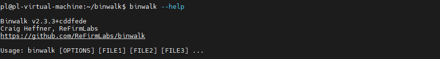

# IoT-Simulation 仿真运行环境搭建

- ubuntu22.04

  ```bash
  sudo apt install openssh-server -y
  ```

## Binwalk v2.3.4

[INSTALL.md](https://github.com/ReFirmLabs/binwalk/blob/v2.3.4/INSTALL.md)

- python3 安装

  ```bash
  # Python3.x
  sudo python3 setup.py install
  ```

- 依赖安装

  ```bash
  sudo pip install nose coverage
  sudo pip3 install pyqtgraph
  sudo pip install pycryptodome
  sudo pip install capstone
  
  sudo apt-get install mtd-utils gzip bzip2 tar arj lhasa p7zip p7zip-full cabextract cramfsswap squashfs-tools sleuthkit default-jdk lzop srecord
  
  # install cramfsprogs 
  git clone https://github.com/davidribyrne/cramfs
  (cd cramfs && make)
  sudo cp cramfs/cramfsck cramfs/mkcramfs /usr/local/bin/
  
  #Install sasquatch to extract non-standard SquashFS images
  sudo apt-get install zlib1g-dev liblzma-dev liblzo2-dev
  git clone https://github.com/devttys0/sasquatch
  (cd sasquatch && ./build.sh)
  
  # Install jefferson to extract JFFS2 file systems
  sudo pip install cstruct
  git clone git@github.com:sviehb/jefferson.git
  (cd jefferson && sudo python3 setup.py install)
  
  # Install ubi_reader to extract UBIFS file systems
  sudo apt-get install liblzo2-dev python3-lzo python3-poetry -y
  git clone --branch v0.8.5-master git@github.com:onekey-sec/ubi_reader.git
  pip install ./ubi_reader
  
  # Install yaffshiv to extract YAFFS file systems
  git clone git@github.com:devttys0/yaffshiv.git
  (cd yaffshiv && sudo python3 setup.py install)
  
  sudo python3 setup.py install
  ```

#### 问题1 unsquashfs.c:1835:5: error: this ‘if’ clause does not guard... [-Werror=misleading-indentation]

```bash
git clone --quiet --depth 1 --branch "master" https://github.com/devttys0/sasquatch
cd sasquatch
wget https://github.com/devttys0/sasquatch/pull/51.patch && patch -p1 <51.patch
sudo ./build.sh
```




## qemu 安装

```bash
# 系统态安装
sudo apt-get install qemu-system -y
# 用户态安装
sudo apt-get install qemu-user-static
```


